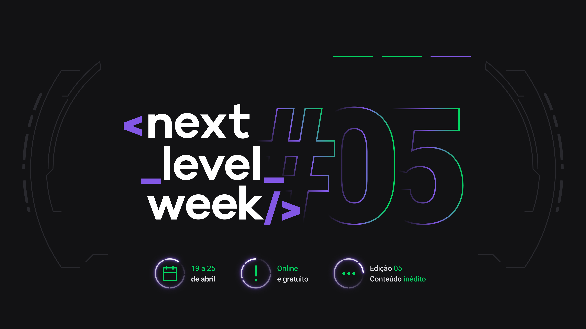

# NLW NodeJS

## Índice

* [1. Introdução](#1-introducao)
* [2. Resumo do projeto](#2-resumo-do-projeto)
* [3. Futuras melhorias](#3-futuras-melhorias)
* [4. Tecnologias Utilizadas](#4-tecnologias-utilizadas)

## 1. Introdução

Este trabalho foi desenvolvido no evento Next Level Week da RocketSeat. O NLW é um evento online com muito código, desafios, networking e um único objetivo: te levar para o próximo nível. 
Sempre com um conteúdo novo a cada edição, você vai descobre na prática uma metodologia eficiente para o seu aprendizado, além de conceitos, ferramentas e hacks que vão impulsionar sua carreira.

## 2. Resumo do projeto
A ideia proposta foi fazer um chat de mensagem instantânea utilizando socket io ,Typescript, framework express entre outras ferramentas, onde é possível registrar os usuários e seu histórico de conversas. Onde existe a tela do cliente que precisa de ajuda e do atendente adm onde presta o atendimento.

## 3. Futuras melhorias

* [ ] Deixar mais interativo
* [ ] Construir uma tela de home
* [ ] Melhorar a tela do atendente
* [ ] Criar um produto
* [ ] Finalização do chamado por parte do cliente
* [ ] Botão para minimizar o chat
* [ ] Colocar um alerta ao receber uma nova mensagem(tanto pelo adm quanto para o cliente)

## 4. Tecnologias Utilizadas

